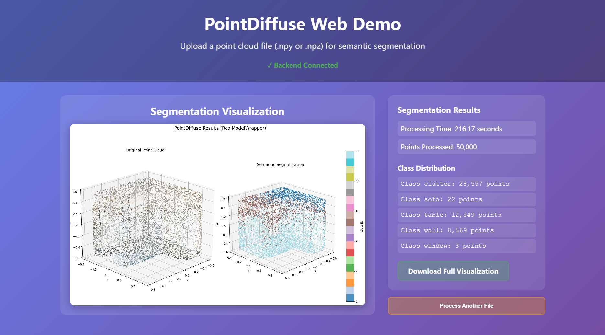

### Results


# PointDiffuse Web Application

A web-based point cloud semantic segmentation application using the PointDiffuse model, built with Flask backend and React frontend.

## 🚀 Features

- **Point Cloud Segmentation**: Upload point cloud files (.npy, .npz) and get semantic segmentation results
- **Real-time Processing**: Fast inference using DDIM sampling for 20x speedup
- **Interactive Visualization**: View segmentation results with class distribution statistics
- **Web Interface**: Easy-to-use React frontend with drag-and-drop file upload
- **Docker Support**: Containerized deployment for easy setup

## 📋 Prerequisites

- Docker and Docker Compose installed
- At least 4GB RAM (8GB recommended for large point clouds)
- CUDA-compatible GPU (optional, for faster inference)

## 🐳 Quick Start with Docker

### Option 1: Using Docker Compose (Recommended)

1. **Clone the repository**
   ```bash
   git clone https://github.com/pngyuo/PointDiffuse-web
   cd pointdiffuse-web
   ```

2. **Start the application**
   ```bash
   docker-compose up -d
   ```

3. **Access the application**
   - Frontend: http://localhost:3000
   - Backend API: http://localhost:5000

### Option 2: Using Pre-built Docker Images

1. **Pull the images from Docker Hub**
   ```bash
   docker pull pngyuo/pointdiffuse-web:backend-v1.0
   docker pull pngyuo/pointdiffuse-web:frontend-v1.0
   ```

2. **Run the backend**
   ```bash
   docker run -d \
     --name pointdiffuse-backend \
     -p 5000:5000 \
     -v $(pwd)/uploads:/app/uploads \
     pngyuo/pointdiffuse-web:backend-v1.0
   ```

3. **Run the frontend**
   ```bash
   docker run -d \
     --name pointdiffuse-frontend \
     -p 3000:80 \
     -e REACT_APP_API_BASE_URL=http://localhost:5000 \
     pngyuo/pointdiffuse-web:frontend-v1.0
   ```

4. **Access the application**
   - Open http://localhost:3000 in your browser

### Option 3: Using Docker Compose with Pre-built Images

Create a `docker-compose.yml` file:

```yaml
version: '3.8'

services:
  backend:
    image: pngyuo/pointdiffuse-web:backend-v1.0
    container_name: pointdiffuse-backend
    ports:
      - "5000:5000"
    volumes:
      - ./uploads:/app/uploads
      - ./model:/app/model  # Mount your trained model here
    environment:
      - MODEL_PATH=/app/model/best_model.pth

  frontend:
    image: pngyuo/pointdiffuse-web:frontend-v1.0
    container_name: pointdiffuse-frontend
    ports:
      - "3000:80"
    environment:
      - REACT_APP_API_BASE_URL=http://localhost:5000
    depends_on:
      - backend
```

Then run:
```bash
docker-compose up -d
```

## 🛠️ Development Setup

### Backend Development

1. **Install dependencies**
   ```bash
   cd backend
   pip install -r requirements.txt
   ```

2. **Run the Flask server**
   ```bash
   python app.py
   ```

### Frontend Development

1. **Install dependencies**
   ```bash
   cd frontend
   npm install
   ```

2. **Start the development server**
   ```bash
   npm start
   ```

## 📁 Project Structure

```
pointdiffuse-web/
├── backend/
│   ├── app.py                 # Flask application
│   ├── model_utils.py         # Model loading and inference utilities
│   ├── PDiffuse_train.py      # PointDiffuse model definition
│   ├── PDiffuse_test.py       # Inference and testing utilities
│   ├── requirements.txt       # Python dependencies
│   └── Dockerfile            # Backend Docker configuration
├── frontend/
│   ├── src/
│   │   ├── components/       # React components
│   │   │   ├── FileUpload.js
│   │   │   ├── PointCloudViewer.js
│   │   │   └── ResultsPanel.js
│   │   └── App.js           # Main React application
│   ├── package.json         # Node.js dependencies
│   └── Dockerfile          # Frontend Docker configuration
├── result/
│   ├── result.png  
└── docker-compose.yml      # Docker Compose configuration
```

## 📊 Model Information

### PointDiffuse Architecture

- **Conditional Network (CNet_θ)**: Full Point Transformer for generating semantic and position conditions
- **Denoising Network (DNet_θ)**: U-Net architecture with Point Frequency Transformers and Denoising PointNets
- **Diffusion Process**: DDIM sampling with configurable steps (default: 20 steps for 20x speedup)

### Supported Datasets

- **S3DIS**: 13 semantic classes (ceiling, floor, wall, beam, column, window, door, table, chair, sofa, bookcase, board, clutter)
- **ScanNet**: 20 semantic classes

## 🔧 Configuration

### Environment Variables

#### Backend
- `MODEL_PATH`: Path to the trained model checkpoint (default: `/app/model/best_model.pth`)

#### Frontend
- `REACT_APP_API_BASE_URL`: Backend API URL (default: `http://localhost:5000`)

### Model Configuration

The application supports various inference configurations:

- **Sampling Method**: DDIM (fast) or DDPM (original)
- **Diffusion Steps**: Configurable (default: 20 for DDIM)
- **Memory Optimization**: Automatic chunking for large point clouds
- **GPU Support**: Automatic CUDA detection

## 📤 Usage

1. **Upload Point Cloud**: Click "Upload Point Cloud" and select a `.npy` or `.npz` file
2. **Processing**: The model will automatically process the point cloud
3. **View Results**: See the segmentation visualization and class distribution
4. **Download**: Download the full-resolution visualization

### Supported File Formats

- **NumPy Arrays (.npy)**: Point cloud data with shape [N, 6] (xyz + rgb) or [N, 3] (xyz only)
- **Compressed NumPy (.npz)**: Compressed point cloud data

### Example Point Cloud Data Format

```python
# Expected format: [N, 6] where columns are [x, y, z, r, g, b]
# - x, y, z: 3D coordinates (float32)
# - r, g, b: RGB colors (0-255, uint8)

import numpy as np

# Example: Create sample point cloud
points = np.random.rand(1000, 3) * 10  # Random 3D points
colors = np.random.randint(0, 256, (1000, 3), dtype=np.uint8)  # Random colors
point_cloud = np.concatenate([points, colors], axis=1)

# Save for upload
np.save('sample_point_cloud.npy', point_cloud)
```

## 🚀 Performance

### Inference Speed
- **DDIM Sampling**: ~20x faster than DDPM (as reported in paper)
- **Memory Optimization**: Automatic chunking for large point clouds (>80K points)
- **GPU Acceleration**: CUDA support with mixed precision

### Memory Requirements
- **Minimum**: 4GB RAM
- **Recommended**: 8GB RAM + GPU with 4GB+ VRAM
- **Large Point Clouds**: 16GB+ RAM recommended

## 🐛 Troubleshooting

### Common Issues

1. **Out of Memory Errors**
   - Reduce point cloud size
   - Use CPU inference instead of GPU
   - Increase Docker memory limit

2. **Model Loading Errors**
   - Ensure model checkpoint is properly mounted
   - Check MODEL_PATH environment variable
   - Verify model file permissions

3. **CORS Issues**
   - Ensure frontend and backend URLs are correctly configured
   - Check REACT_APP_API_BASE_URL environment variable

### Debug Mode

Enable debug logging by setting environment variables:

```bash
export FLASK_DEBUG=1  # Backend debug mode
export REACT_APP_DEBUG=1  # Frontend debug mode
```

## 🤝 Contributing

1. Fork the repository
2. Create your feature branch (`git checkout -b feature/AmazingFeature`)
3. Commit your changes (`git commit -m 'Add some AmazingFeature'`)
4. Push to the branch (`git push origin feature/AmazingFeature`)
5. Open a Pull Request

## 📚 Citation

If you use this implementation, please cite the original PointDiffuse paper:

```bibtex
@article{he2025pointdiffuse,
  title={PointDiffuse: A Dual-Conditional Diffusion Model for Enhanced Point Cloud Semantic Segmentation},
  author={He, Yong and Yu, Hongshan and Feng, Mingtao and Chen, Tongjia and Li, Zechuan and Ulhaq, Anwaar and Anwar, Saeed and Mian, Ajmal Saeed},
  journal={arXiv preprint arXiv:2503.06094},
  year={2025}
}
```

**Paper Link**: [https://arxiv.org/abs/2503.06094](https://arxiv.org/abs/2503.06094)

## 🛟 Support

For issues and questions:

1. Check the [Issues](https://github.com/your-repo/issues) page
2. Create a new issue with detailed description
3. Include error logs and system information

## 🎯 Roadmap

- [ ] Support for more point cloud formats (PLY, LAS)
- [ ] Real-time point cloud streaming
- [ ] Multiple model support
- [ ] Advanced visualization options
- [ ] Batch processing capabilities
- [ ] Model training interface